# Perplexity AI 使用大全：6 大情境 × 24 個 Prompt 讓你效率翻倍

---

你是不是也有過這種經驗？Google 一個問題，跳出幾十個網頁，點開第一個看了半天還是搞不懂，然後又跳到第二個、第三個......結果一個小時過去了,資料散落各處,腦袋還是一團亂。

Perplexity AI 的出現,就是為了解決這個問題。它不只是另一個搜尋引擎,而是一個會幫你「讀資料、抓重點、給答案」的 AI 助手。想像一下:你問一個問題,它馬上整理好答案給你,還附上資料來源讓你查證。不用再開十幾個分頁,不用再自己拼湊資訊碎片。

這篇文章會帶你完整認識 Perplexity——從它到底是什麼、跟 ChatGPT 有什麼不同,到實際操作技巧和 24 組實用 Prompt。不管你是學生、上班族、創作者還是研究人員,都能找到適合自己的使用方式。

---

## Perplexity AI 是什麼？和 GPT 差在哪？

Perplexity AI 說穿了就是「搜尋引擎 + AI 助理」的混合體。你丟問題給它,它會先理解你在問什麼,然後從網路上找最新、最相關的資料,整理成一段清楚的答案。省去你自己一個個點連結、讀長篇文章的麻煩。

最貼心的是,每個答案旁邊都會列出參考來源。你可以直接點進去確認,或繼續延伸閱讀。等於把一個懂得幫你抓重點的 AI 放進搜尋流程中。

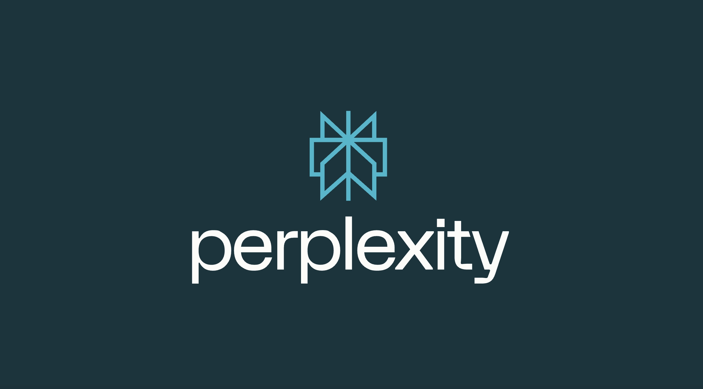

但你可能會好奇:Perplexity 跟其他 AI 工具比起來,到底差在哪？

其實最大差別在於「角色定位」不同:

**Perplexity 是「AI 搜尋平台」**,核心功能在整合多個語言模型(像 GPT、Claude、Llama、自家 Sonar),結合即時網路搜尋,提供包含資料來源、更新速度快、內容多元的回答。

**其他 AI 如 ChatGPT 與 Gemini 則是「單一 AI 對話助理」**,由某個語言模型單獨驅動,專注與用戶進行自然對話、內容生成、語意理解等任務。

簡單來說:Perplexity 擅長「找資料、給來源」;ChatGPT 擅長「深度對話、創意生成」。一個是研究助手,一個是創作夥伴。

### Perplexity AI 適合誰使用？

Perplexity AI 最大特色就是能節省大量搜尋和整理資訊的時間,因此特別適合以下族群:

**1. 學生和學術研究者**

Perplexity 能快速整合學術論文、新聞報導與網路資訊,並以條列化或段落式的方式輸出重點摘要。每一則回應都附有資料來源連結,方便比對與引用,提升報告品質與查證效率。

**2. 研究人員和專業工作者**

當你遇到難以理解的術語或複雜主題,只要提出問題,Perplexity AI 會用較口語、具邏輯的方式說明概念,並提供延伸閱讀方向,提升研究效率。

**3. 內容創作者和行銷人員**

Perplexity 能有效協助規劃主題、發想切入點、統整資料,讓產出更具結構與說服力。對行銷企劃來說,能快速瞭解不同市場或目標族群的需求,提升溝通效率與內容品質。

如果你正在尋找能夠提升工作效率的 AI 工具,不妨試試 👉 [Perplexity Pro 年費成品號,24H 自動發貨,365 天質保!](https://shaoyumi.com/buy/64)

**4. 一般資訊搜尋者**

Perplexity 能即時整合大量搜尋結果,並篩選出具參考價值的內容。對於希望快速取得可靠資訊、又不希望花時間逐一瀏覽網頁的使用者來說,是一個有效率且減少錯誤判讀風險的選擇。

**5. 中文使用者或地區限制用戶**

雖然 Perplexity AI 最初是針對英語設計,但目前已經支援中文輸入與回應。對台灣、香港等中文地區的使用者來說,使用門檻大幅降低,讓它更容易被應用在中文寫作、中文市場的資料查詢與內容整理上。

---

## 深入剖析 Perplexity:10 個你一定要知道的優缺點分析

### Perplexity 優點

**1. 問答式搜尋|自然語言理解更準確**

Perplexity 支援直接以自然口語的方式提問,不需特別設計關鍵字。系統能透過語意判斷問題的核心,再根據理解提供結構化、聚焦的回答,降低搜尋門檻,也避免跳出一堆無關內容。

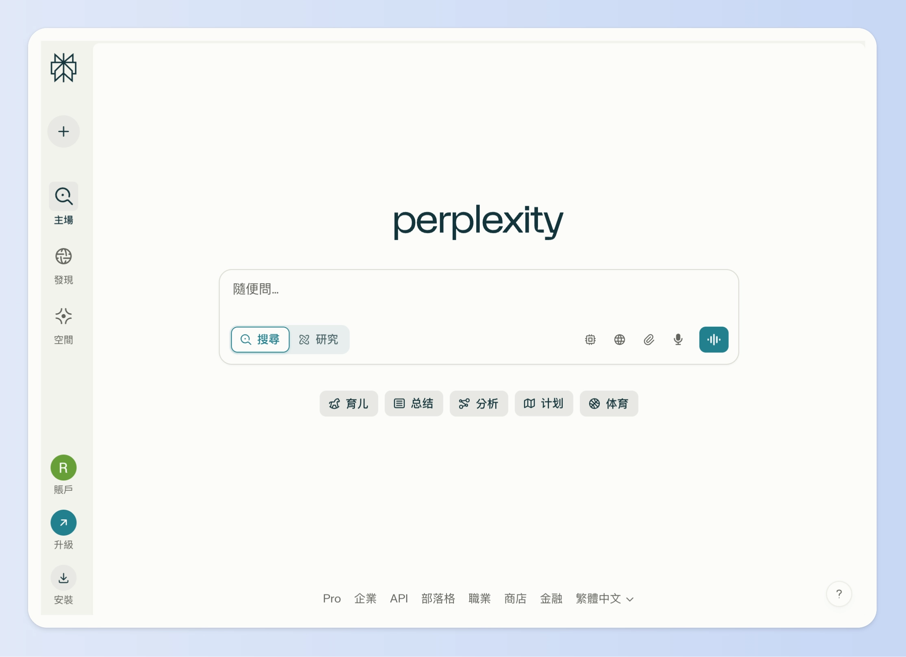

**2. 即時資料整合|回應具時效性與參考價值**

不同於靜態知識庫,Perplexity 能連接外部網路,檢索最新的新聞報導、網站內容或公開資料,讓它能回應當前事件、趨勢或動態議題,提供符合時間背景的資訊,而非過時內容。

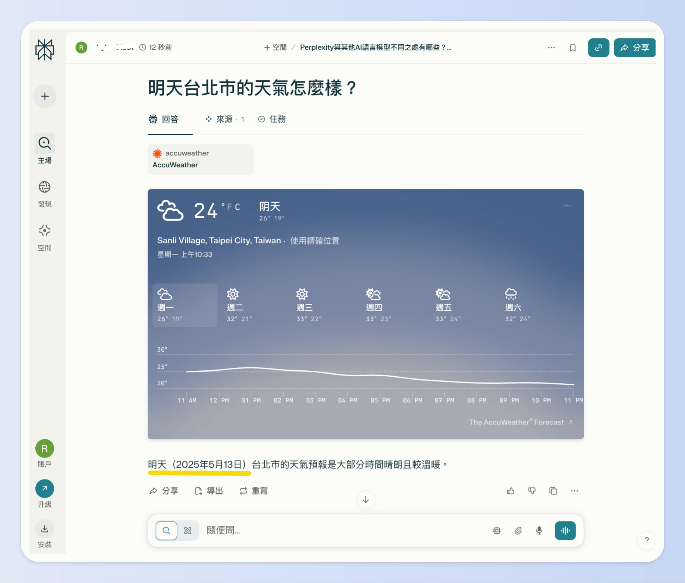

**3. 附上資料來源|回覆透明、方便查證**

Perplexity 的每則回覆都會附上明確的來源網址,像新聞網站、官方公告或研究報告。使用者可以查閱原始資料,確認脈絡與真偽,提高回應的可用性與信任度,適合做研究或報告參考。

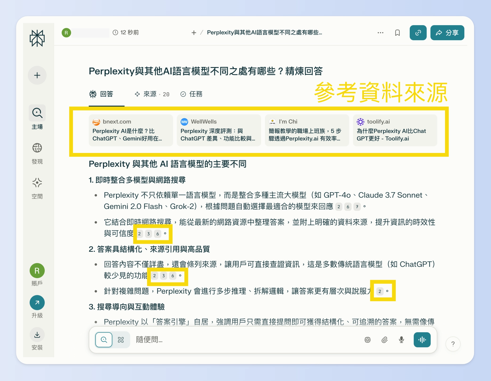

**4. 持續延伸問題|多輪對話保留脈絡**

Perplexity 不只具備上下文記憶,能理解前後提問的脈絡,還會根據使用者當下的問題,自動推薦延伸提問。讓使用者無需額外思考下一步該問什麼,就能快速點選系統建議的問題繼續查詢。主動預測與串連問題的功能,大幅提升資訊搜尋效率。

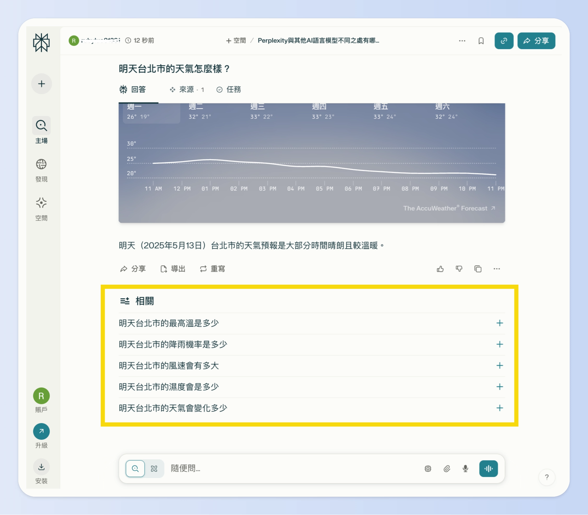

**5. 多種資料型態整理|提升閱讀與理解效率**

根據不同問題類型,Perplexity 不僅提供一般段落式回覆,也能輸出清單、表格或條列比較等形式,將複雜資訊視覺化,讓使用者更方便閱讀理解,尤其在做決策或分析時特別實用。

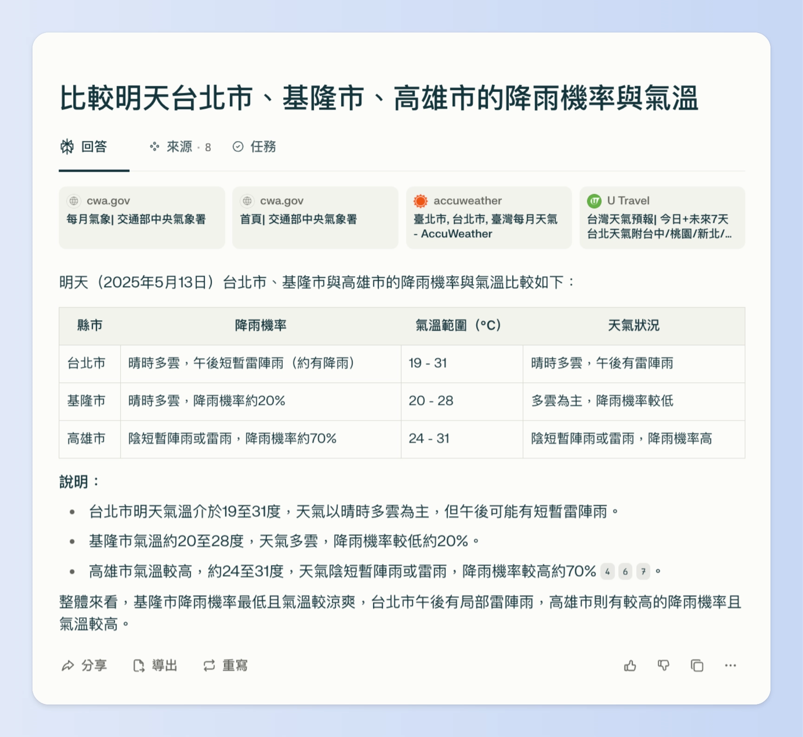

**6. 多模型支援|根據問題自動切換最佳模型**

Perplexity 並非依賴單一語言模型,而是能依問題性質動態選用 GPT-4、Claude、Grok 等不同模型處理提問。彈性設計提升回答的準確性與深度,適用廣泛領域的使用需求。

但免費方案帳號僅能使用系統預設模型,無法自行切換。若升級為 Pro 方案後,則可在回應區域或偏好設定中自由選擇回應模型,因應不同查詢需求。

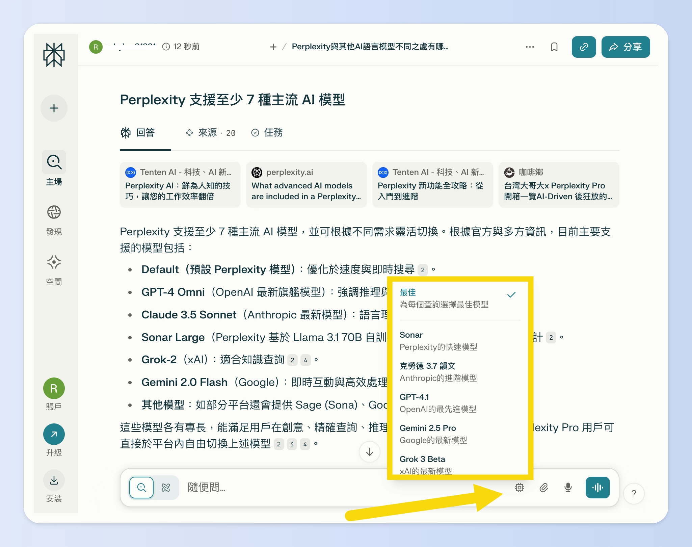

**7. 支援多語言提問|非英語系使用體驗良好**

雖然 Perplexity AI 最初是針對英文設計,但目前已經支援日文及中文輸入與回應。對日本、台灣及香港等中文地區的使用者來說,使用門檻大幅降低,讓它更容易被應用在非英語系的寫作、市場資料查詢與內容整理上。

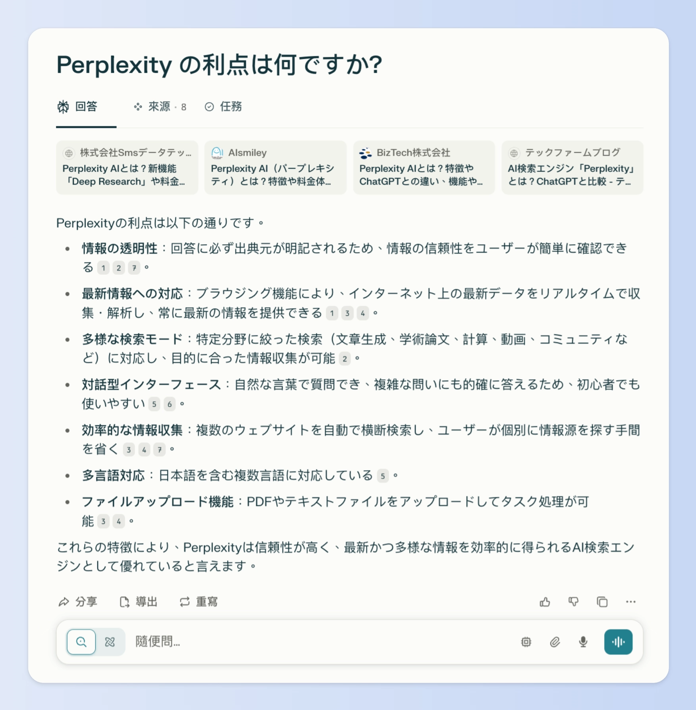

### Perplexity 缺點

**1. 回答品質依賴外部資料來源**

Perplexity 的回覆大多來自網路即時搜尋,若原始內容出現錯誤、過時或偏頗,AI 可能也會無法判錯誤而誤用這類資料。表示 Perplexity 的回答品質與資訊來源的可信度高度相關,無法保證每次輸出的回覆都完全正確,因此使用者仍需具備判讀資料與查證真偽的能力。

**2. 依賴網路連線品質**

Perplexity 必須即時連接網路查找資料並生成回應,無法離線使用。且在網路不穩或封鎖特定外部服務的環境下,可能無法正常操作或載入內容,使用體驗會明顯下降。

**3. 深度資料分析能力有限**

雖然 Perplexity 擅長資訊彙整與摘要,但當面對需要跨資料整合、邏輯推理或專業判讀(例如財報細節比對、數據計算)的任務時,表現仍有侷限,目前無法完全取代人工分析的深度與精準度。

---

## 別再只會 Google!5 步驟學會 Perplexity AI 搜尋新體驗

接著,我們用「如何找出長尾關鍵字」這個常見 SEO 問題做為範例,教你怎麼實際運用 Perplexity:

### Step.1:進入 Perplexity.ai 首頁、列出問題

首先進入 Perplexity 頁面。可以選擇是否登入帳號,登入後可以保留提問紀錄、建立資料夾,還能使用更多進階功能。不想登入也沒關係,直接使用網頁版一樣沒問題。

Perplexity 也有推出 Chrome 外掛、Android 和 iOS 的手機 App,操作介面與網頁版相似。

接著,針對自己想了解的主題列出詳盡的問題。我們以「長尾關鍵字」為例,可能有的問題像是:

- 長尾關鍵字是什麼?有什麼定義?
- 不知道長尾關鍵字有什麼用
- 不知道怎麼找長尾關鍵字
- 找到長尾關鍵字後,不知道要怎麼放進文章
- 容易把相似關鍵字混在一起

### Step.2:向 Perplexity AI 提問

根據列好的問題清單,一條一條地輸入到 Perplexity.ai 中提問。

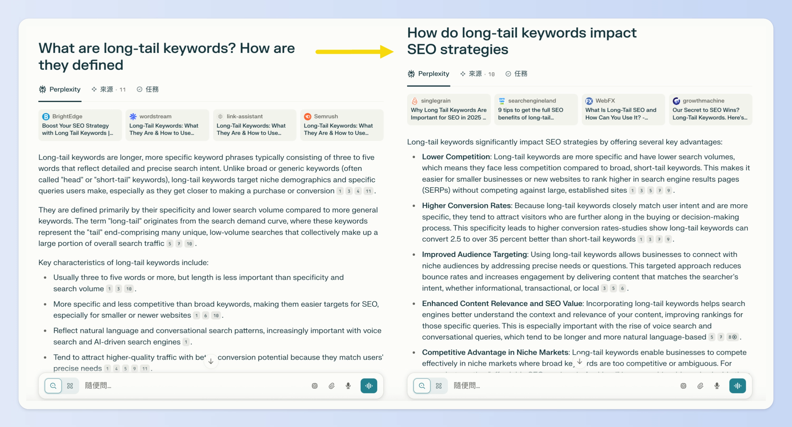

提問時有個實用的小技巧:盡量使用英文提問。

原因很簡單——網路中,英文內容量遠大於中文,資訊更豐富、來源更廣泛。尤其是當你在研究冷門主題或專業技術領域時,英文結果會更豐富、也更容易找到第一手資訊,大幅提升 AI 回覆的廣度與深度。

### Step.3:查看回覆與資料來源

Perplexity 會自動從多個資料來源整理出一段精簡的回覆,同時在回答內容旁邊標示出對應的原始出處。資料來源可能來自新聞網站、專業報導或資料庫,點擊後可直接查看全文,方便你深入了解背景或交叉查證。

但若是怕自己的英文程度不夠,也別擔心看不懂 AI 整理出的回應。Perplexity 提供完整的中文介面與翻譯功能,只要依照下列步驟設定一次,之後回覆都會顯示為繁體中文:

右下角「帳戶」>「設置」>「偏好設定」>「偏好的回覆語言」Preferred Language 調整成「Traditional Chinese(繁體中文)」。

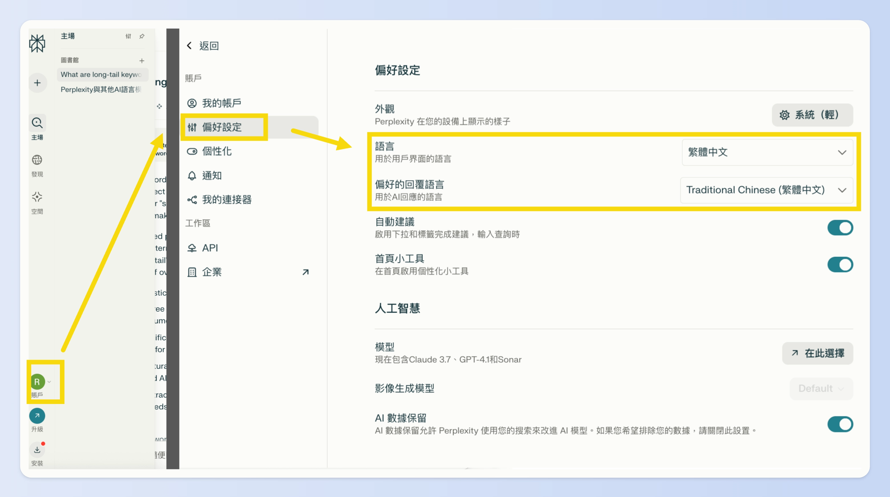

這樣一來,AI 整理的資訊就會自動翻譯為清楚易懂的繁體中文,同時保留英文原文連結,方便你視情況深入閱讀。

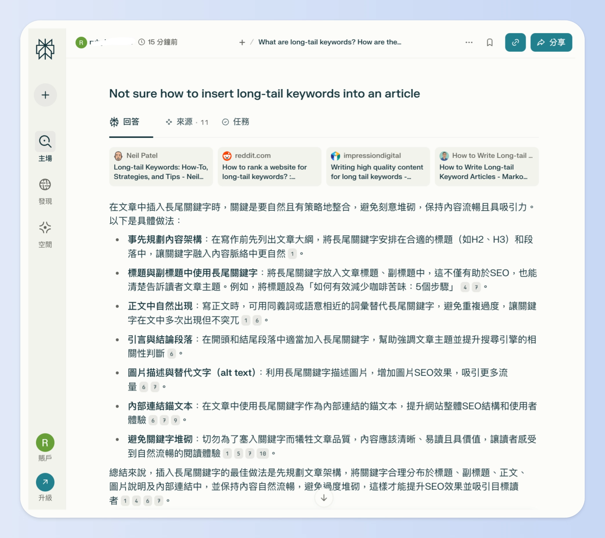

### Step.4:切換多種模式

使用 Perplexity 時,除了直接輸入問題獲取答案外,還可以切換不同的搜尋模式,獲得更符合需求的多元內容,例如具體的舉例、案例分析或相關影片。

在 Perplexity 的搜尋欄下方,有一個「Focus」按鈕,點開後會出現以下六種模式:

- **Web:**整合網路資訊,適合快速取得綜合性內容與概覽
- **Academic:**搜尋論文庫,適用於學術研究與引用
- **Math:**透過 Wolfram Alpha 解答數學、統計、物理等複雜計算
- **Writing:**由 AI 生成內容,不連接網路,適合創作發想與文案撰寫
- **Video:**搜尋 YouTube 等影片資源,適合找教學或操作示範
- **Social:**擷取 Reddit 等社群討論,掌握熱門話題與真實經驗分享

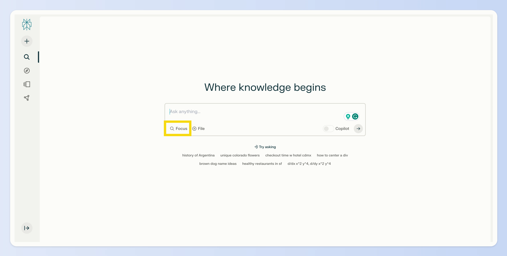

如果你在介面上沒有看到「Focus」功能,也不用感到疑惑,因為 Perplexity 逐步以新的「選擇來源(Choose Sources)」功能取代原本的 Focus 模式。讓使用者可以更靈活決定搜尋時要參考哪些資料來源。可選項目包含:

- **Web:**僅從公開網路中搜尋資訊
- **Org Files:**僅使用使用者或團隊上傳的內部文件
- **Web + Org Files:**結合網路與組織文件來源一併搜尋
- **None:**完全不引用外部資料,僅依據系統內建知識庫回答

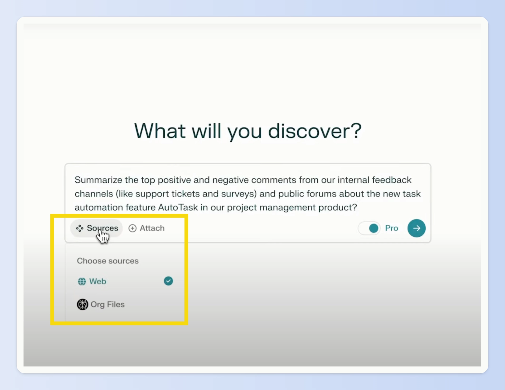

### Step.5:整理並導出資料

我們可以重複以上步驟,重複輸入問題→獲得解答→輸入問題→切換資料來源模式,直至完成所有問題。

再根據 Perplexity 給的回覆,將建議的長尾關鍵字或工具紀錄下來,利用「筆記功能」建立主題資料夾,將對話紀錄分類保存,方便後續使用或團隊分享,或是直接回覆「導出」成單獨一份檔案。

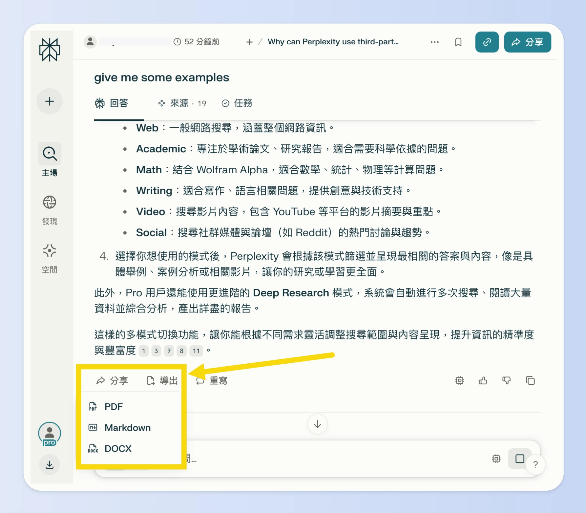

---

## Perplexity 使用全攻略!6 大場景 × 24 組超實用 Prompt 一次打包

### 技能學習類

適合自學、考試準備、語言入門,幫助你有系統地整理知識內容。

**🔹 使用場景範例|創建學習指南:**針對特定主題整理重點、關鍵詞與學習步驟。

**📝 Prompt 範例**

- 「為高中地理的『地形系統』單元,創建一份學習指南,內容包含:重點概念解釋、關鍵術語定義、常見錯誤迷思,以及建議的複習順序與練習題類型。」
- 「整理準備『投資型保險商品業務員』認證考試所需的主要知識領域與學習資源。」

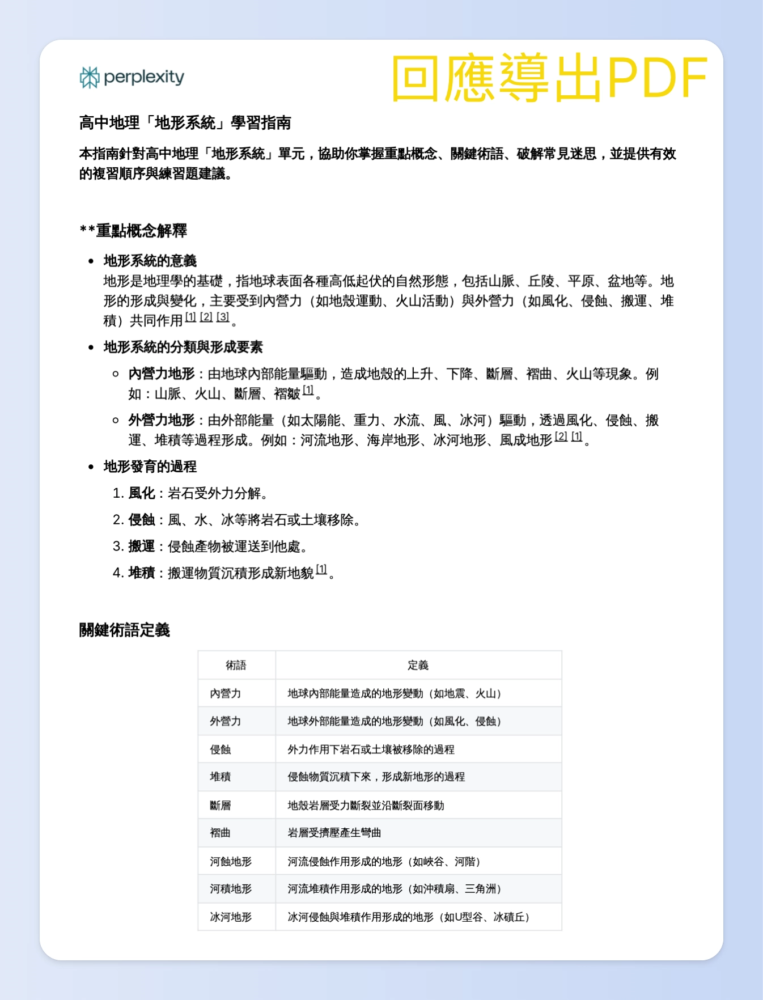

**🔹 使用場景範例|基本外語教學:**幫你從基礎開始學習語言結構、單字與常用句型。

**📝 Prompt 範例**

- 「我想從零開始學日文,請以『打招呼、點餐、問路、購物、介紹自己』五個主題,分別列出常用句型、基礎單字與中文翻譯。」
- 「用英文解釋"sustainability"的意思,並列出 3 個常見用法。」

### 生活應用類

適合日常生活安排、飲食管理、旅遊行程等多元需求。

**🔹 使用場景範例|尋找食譜:**根據食材、飲食習慣或料理風格推薦菜單。

**📝 Prompt 範例**

- 「我的冰箱裡目前有雞胸肉、洋蔥、花椰菜和雞蛋,請根據這些材料推薦三道簡單又健康的家常料理,每道菜附上作法與熱量估算。」
- 「我正在控制碳水攝取量,請提供三道低碳、高蛋白的健身友善晚餐食譜,並說明每道菜的營養價值。」

**🔹 使用場景範例|規劃行程:**幫你設計旅行路線與每日活動建議。

**📝 Prompt 範例**

- 「幫我規劃一趟台南三天兩夜自由行行程,包含每天的活動建議、在地美食、住宿推薦與交通方式,適合第一次造訪的旅客。」
- 「請設計一趟東京五日自由行,重點放在文化景點與購物地點,每日行程請包含地鐵路線與預估花費。」

### 職場應用類

提升工作效率,協助你處理翻譯、簡報、研究與溝通任務。

**🔹 使用場景範例|文本翻譯與潤稿:**快速翻譯並提升語句表達。

**📝 Prompt 範例**

- 「以下是我寫的中文簡報內容,請幫我翻譯成流暢、正式的英文簡報語氣,適合用於向國際客戶提案。」
- 「這段英文 Email 過於直白,請幫我潤飾語氣,讓內容更有禮貌且符合商業溝通習慣。」

**🔹 使用場景範例|市場研究:**快速整理競品、產業趨勢與消費者調查結果。

**📝 Prompt 範例**

- 「分析 2025 年全球電動車市場的三大發展趨勢,並列出主要競爭品牌與預估成長數據(若有)。」
- 「我正在評估設計工具的市場定位,請比較 Canva 與 Figma 的核心功能、收費方案、主要用戶族群與品牌差異。」

### 特定技術類

支援程式語言教學、錯誤排查與技術文件生成。

**🔹 使用場景範例|撰寫程式碼:**生成範例程式碼或設計基礎架構。

**📝 Prompt 範例**

- 「請用 Python 寫一段程式碼,可以讀取指定 CSV 檔案中的資料,根據『價格』欄位做升冪排序,並輸出前五筆資料。」
- 「建立一個 HTML 表單,包含姓名、Email、電話號碼欄位,並在點擊送出按鈕後跳出確認訊息。」

**🔹 使用場景範例|回答技術問題:**解釋錯誤訊息、建議最佳做法。

**📝 Prompt 範例**

- 「我在使用 React 的 useEffect 時出現'missing dependency'警告,請解釋這個錯誤的原因與正確用法,並提供範例修正方式。」
- 「請說明什麼是 API rate limit,為何會被限制,以及開發者在串接 API 時應該採取哪些措施避免觸發限制。」

### 搜尋資料類

整合網路資訊、引用來源、回答精確事實。

**🔹 使用場景範例|尋找來源與引用:**列出具可信度的參考資料。

**📝 Prompt 範例**

- 「請列出三篇近五年內發表的關於『減糖飲食對代謝健康影響』的學術研究,包含標題、作者、摘要與出處連結。」
- 「我想找可靠資料證明久坐會影響心血管健康,請提供來自醫學期刊或衛生單位的相關報告。」

**🔹 使用場景範例|獲取事實與定義:**快速取得準確定義與解釋。

**📝 Prompt 範例**

- 「請用清楚簡明的語言解釋『ESG』的意思,分別說明 Environmental、Social、Governance 各代表什麼,並舉例實際應用情境。」
- 「什麼是 ROAS?請說明計算方式,並舉一個電商廣告活動的實際案例幫我理解。」

### 生成內容類

用於構思、起草與內容撰寫初稿。

**🔹 使用場景範例|撰寫草稿:**協助生成文章、簡報或 Email 初稿。

**📝 Prompt 範例**

- 「請撰寫一篇 500 字的部落格草稿,主題為『AI 工具如何協助中小企業提升工作效率』,內容需包含三項應用場景與一段總結。」
- 「我正在為品牌重塑提案做簡報,請幫我寫一段約 100 字的開場白,語氣專業、有溫度,並點出品牌目前面臨的轉型挑戰。」

**🔹 使用場景範例|提供靈感:**幫助找切角、標題與段落架構。

**📝 Prompt 範例**

- 「我正在規劃母親節行銷活動,請幫我想五個有吸引力的主題與對應的促銷構想,適合保健品品牌使用。」
- 「我準備寫一篇關於乾洗髮使用教學的文章,請幫我列出文章結構,包括開頭鋪陳、內容段落安排與結尾 CTA。」

---

## Perplexity AI 免費怎麼用?5 個常見 Q&A 一次解惑

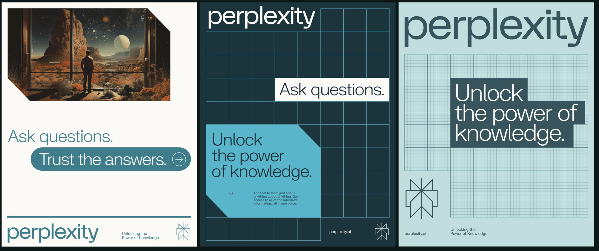

### Perplexity 是免費的嗎?

Perplexity 不是完全免費。Perplexity.ai 提供免費(Basic)與付費(Pro)兩種方案版本。免費版可直接使用基本搜尋與問答,進階功能(如模型切換、文件上傳、更多使用量)則需訂閱 Pro 版。

### Perplexity 有手機版嗎?

有。Perplexity 支援 iOS 與 Android App,可至 App Store 或 Google Play 搜尋「Perplexity – Ask Anything」下載使用,介面與功能與網頁版相似。

### 可以上傳檔案或讓 Perplexity AI 閱讀文件嗎?

Pro 方案用戶可以使用「Uploads」功能上傳 Excel、PDF、Word 等文件,AI 會根據文件內容回答提問,適合資料分析、閱
